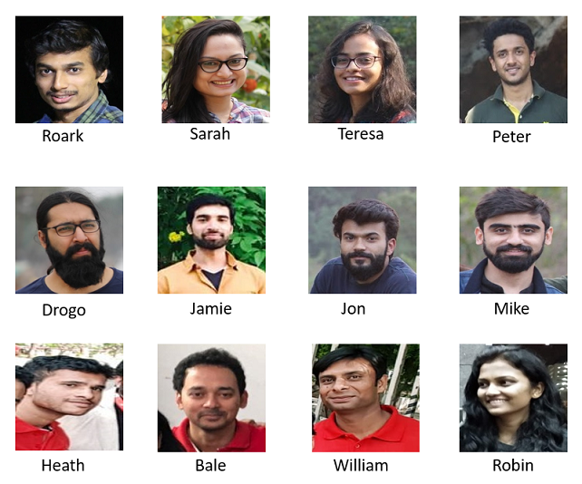
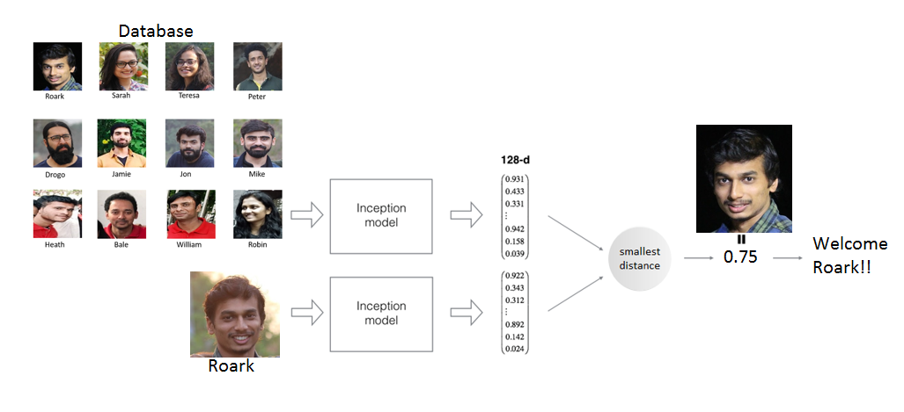
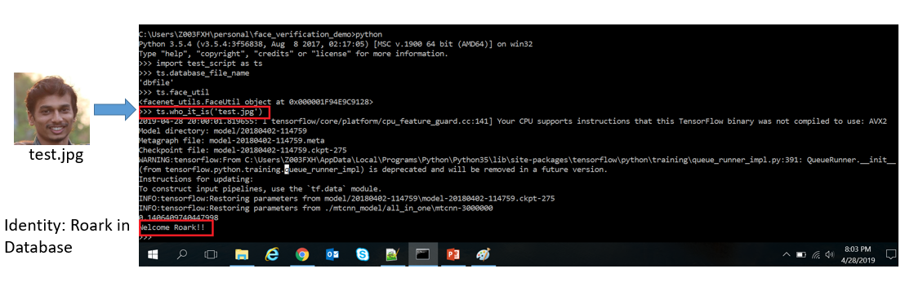

# face_recognition_demo
This is a simple example for face verification using [facenet : A unified Embedding for face recognition &amp; clustering](http://arxiv.org/abs/1503.03832) implemented by davidsandberg.

## Requirements
```
Linux (Tested on Windows 10)
Python
Python Packages
 - numpy
 - opencv-python
 - TensorFlow
 - scipy
 - sklearn
 - pickle
```
you can install the python package using `pip install <package_name>`


## Inspiration
I came across FaceNet network, which performs the task of face recognition, verification & clustering. So I decided to try my
hands on this fancy stuff as well.

## Model Download (pretrained)
- Download the MTCNN model from [here](https://github.com/wangbm/MTCNN-Tensorflow/tree/master/save_model) and place it under `mtcnn_model` directory.<br />
NOTE: The MTCNN models have already been checked in the repo, so you will see the related files under `mtcnn_model/` directory
but you are free to change or replace it with your own custom models.
- Download facenet model from [here](https://drive.google.com/file/d/1EXPBSXwTaqrSC0OhUdXNmKSh9qJUQ55-/view) and copy to `model` directory
After Download and extracting your directories should look something like this
```
face_verification_demo
├─ mtcnn_model
|   ├─ all_in_one
│   |   ├─ checkpoint.txt
│   |   ├─ mtcnn-3000000.data-00000-of-00001
│   |   ├─ mtcnn-3000000.index
│   |   └─ mtcnn-3000000.meta
├─ model
|   ├─ 20180402-114759
│   |   ├─ 20180402-114759.pb
│   |   ├─ model-20180402-114759.ckpt-275.data-00000-of-00001
│   |   ├─ model-20180402-114759.ckpt-275.index
│   |   ├─ model-20180402-114759.meta
└─ ...
```

## Preprocessing using MTCNN Face Alignment
Multi Task Cascaded Convolutional Networks performs face detection along with detection landmarks (eyes, nose & mouth endpoints). 
They provide a very high accuracy in real time. MTCNN leverages cascaded architectures 
with three stages of carefully designed deep convolutional networks to predict the same.
Refer to [README.md inside mtcnn_src dir](./mtcnn_src/README.md) to understand its model architecture.

Therefore MTCNN is used to crop faces from the images, which in turn is fed as input to our FaceNet Network.

## Overview of the FaceNet Model
FaceNet is a neural network that learns a mapping from images to a compact Eucledian space where distance correspond to measure of 
face similarity. Therefore similar face images will have lesser distance between them and vice versa. Once we have the feature vector/
Eucledian embedding per image using the deep convolutional network (FaceNet), 
tasks such as face recognition, clustering & verification can easily be implemented.
<p align="center">
	
</p>

The advantage of using the 128D embedding is that you don't need to retrain you model to recoginize new faces.
All you need is a single image for an individual to get that embedding once passed throught the network.
That embedding can be stored and used as a reference for any future queries. This makes FaceNet even more powerful.

### Triplet Loss
FaceNet uses a distinct loss method called Triplet Loss to calculate loss. 
Triplet Loss minimises the distance between an anchor and a positive, 
images that contain same identity, and maximises the distance between the anchor and a negative, images that contain different identities.
<p align="center">
	
</p>

Conceptually it means, Faces of same identity should appear closer to each other than faces of another identity.
## Implementation
### 1. Database
Here is what the `images` directory looks like:
<p align="center">
	
</p>

Database has several images of persons, for which we will generate the 128D embedding( or feature vector) and will get the 
eculedian distance of test image with each of the previously created embedding. If the distance is less than a certain 
threshold, meaning images are from a same person.


NOTE: To avoid generating the embeddings every time we execute the `test_script.py` we will dump the embeddings in a pickle
file & then reuse it for further references.


If you want to run on your own set of images, simply add your own images to `images` directory.

In my implementation, I have used tensorflow. Additionally I have written `facenet_utils.py` that interacts with `facenet.py`
and `MTCNNWrapper.py` to abstract all interactions with both the networks (MTCNN & FaceNet). 
It also has utility methods to return the 128D feature vector.
```
 # create database pickle file, if not exists
    if not os.path.exists('dbfile'):
        encodings = face_util.convert_to_embedding()
        store_data(encodings)

    # read the pickle file
    enc_list = load_data()
```
Above code will generate the 128D feature vector for all the images in the `images` directory.
if `dbfile` exists in the same working directory, then it will load the embeddings from there. <br />
NOTE: if you have added images into the `images` directory, make sure to delete the `dbfile` and then re-run the script.


Visual Representaion as to what script `test_img.py` is doing is as follows:
<p align="center">
	
</p>

## Results
Below are the test results: <br />
<p align="center">
	
</p>

## References
- MTCNN paper link: [Joint Face Detection and Alignment using Multi-task Cascaded Convolutional Networks](https://arxiv.org/pdf/1604.02878v1.pdf)
- MTCNN Web Link: https://kpzhang93.github.io/MTCNN_face_detection_alignment/index.html
- https://github.com/wangbm/MTCNN-Tensorflow
- https://github.com/davidsandberg/facenet
- https://github.com/amenglong/face_recognition_cnn
- https://hackernoon.com/building-a-facial-recognition-pipeline-with-deep-learning-in-tensorflow-66e7645015b8
- https://towardsdatascience.com/deep-learning-4-embedding-layers-f9a02d55ac12
- https://medium.freecodecamp.org/making-your-own-face-recognition-system-29a8e728107c
