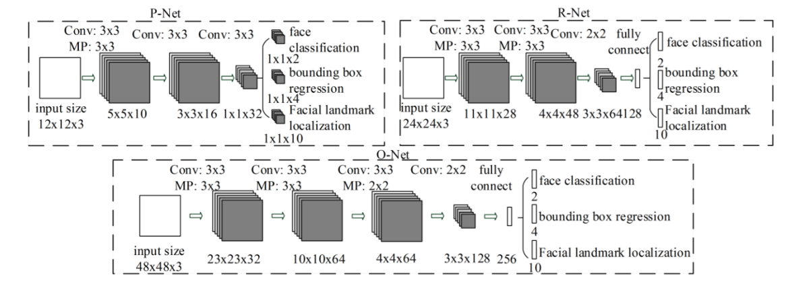
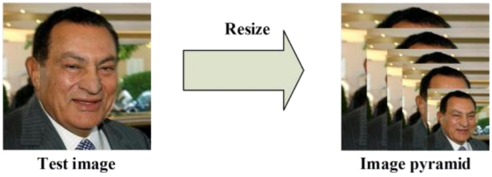
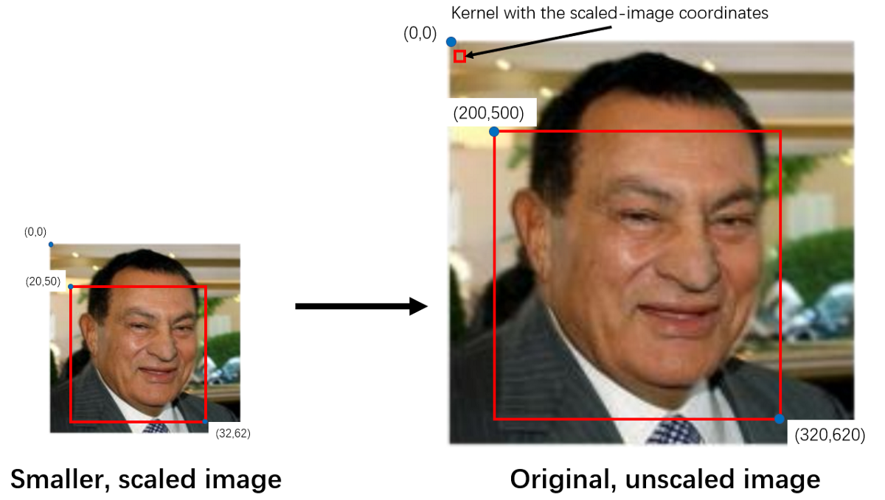
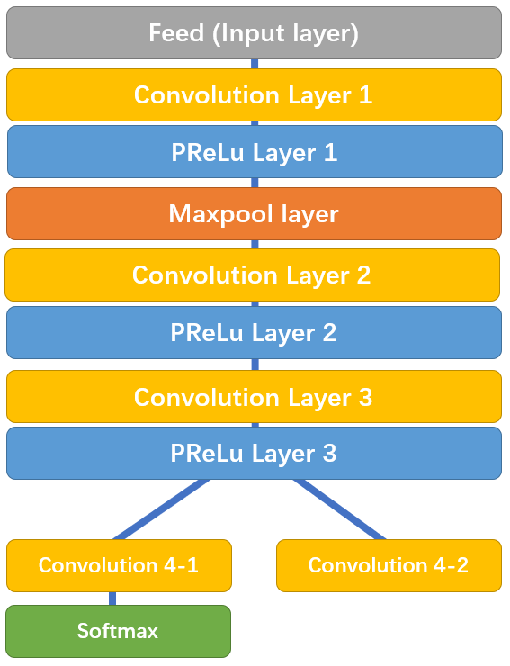
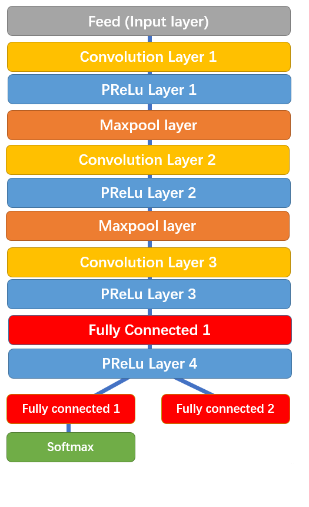

# MTCNN Face Detection & Alignment
Joint Face Detection and Alignment using Multi-task Cascaded Convolutional Neural Networks
Developed by kpzhang93

## Overview of the model
The MTCNN model has three convolutional networks (P-Net, R-Net, O-Net) and is able to outperform other
face detection algorithms with real time performance.
Here is how the model architecture looks like:

## How it works?
Multiple scaled copies of images are created, called as the image pyramid before passing to the netowork. It is done so
as to find faces of different sizes (big and small) in the images.
Below figure depicts the multiple scaled images.

### Stage 1 (P-Net)
For each scaled image, a 12x12 kernel convolves over every part of the image, scanning for a face.
It starts from the top left corner of the image and that portion is passed to P-Net to get the bounding box of the face, if present.
The process is repeated until whole of the image is scanned. Therfore the kernel moves to the right and bottom (one at a time)
by a stride of 2 pixels.
Stride of 2 helps in reducing the computational complexity without hampering the performance. 
Since it is highly unlikely to have a face in just 2 pixels, therefore it's highly improbable to miss a face becuase of the stride of 2 pixels.
But it does leads to significant performance improvement and less memory consumption.

The P-Net returns the list of bounding boxes along with their confidence levels. Bounding boxes with high confidence levels are retained and
rest are deleted i.e. the ones which the network is not sure to have a face.

NOTE: the coordinates of the bounding boxes (returned by P-Net) needs to be converted to the actual unscaled images.
Below figure depicts the same.

Next step would be to apply non max supression to eliminate bounding boxes with high confidence and high overlap between them.
This helps in getting rid of redundant bounding boxes, allowing us to narrow our search down to one accurate box per face.

The P-Net converts the bounding boxes coordinates to squares by elongating the shorter sides. Finally bounding box coordinates are
saved and passed onto next stage. (R-Net)

The structure of P-Net looks like this:

convolution 4-2 outputs coordinates of bounding boxes while convolution 4-1 outputs probability of being a face in each bounding box

### Stage 2 (R-Net)
It takes into account the bounding boxes which are out-of-bounds by performing padding.

R-Net’s output is similar to that of P-Net: 
It includes the coordinates of the new, more accurate bounding boxes, as well as the confidence level of each of these bounding boxes

Once again, we get rid of the boxes with lower confidence, and perform NMS on every box to further eliminate redundant boxes. 
Since the coordinates of these new bounding boxes are based on the P-Net bounding boxes, we need to convert them to the standard coordinates.
After standardizing the coordinates, we reshape the bounding boxes to a square to be passed on to O-Net.

Here is how R-Net structure looks like. It takes the P-Net bounding boxes as input and refines the coordinates

Similarly, R-Net splits into two layers in the end, giving out two outputs: 
the coordinates of the new bounding boxes and the confidence level in each bounding box.

### Stage 3 (O-Net)
The outputs of O-Net are slightly different from that of P-Net and R-Net. O-Net provides 3 outputs: the coordinates of the bounding box (out[0]), 
the coordinates of the 5 facial landmarks (out[1]), and the confidence level of each box (out[2]).

Once again, we get rid of the boxes with lower confidence levels, and standardize both the bounding box coordinates and the facial landmark coordinates. 
Finally, we run them through the last NMS. At this point, there should only be one bounding box for every face in the image.

Here is how the O-Net structure looks like. It takes R-Net bounding boxes as inputs and marks down the coordinates of facial landmarks.

It returns three outputs:
- the probability of a face being in the box
- coordinates of the bounding boxes
- coordinates of the facial landmarks (eyes, nose and mouth endpoints)

The final step will be to package all the information into a dictionary with three keys:
`box`, `confidence`, and `keypoints`

- `box` contains coorniates for each bounding box
- `confidence` contains confidence level of the network for each face detected
- `keypoints` contains the coordinates of each facial landmark (eyes, nose and mouth endpoints) for each face.

`mtcnn.py` implements the above three models i.e `PNet`, `RNet`, `ONet`. You can go through it for better understanding.

To understand more about MTCNN, you can refer here:
- Github Repo : https://github.com/ipazc/mtcnn
- Research Article :http://arxiv.org/abs/1604.02878
- WebPage: https://kpzhang93.github.io/MTCNN_face_detection_alignment/index.html

